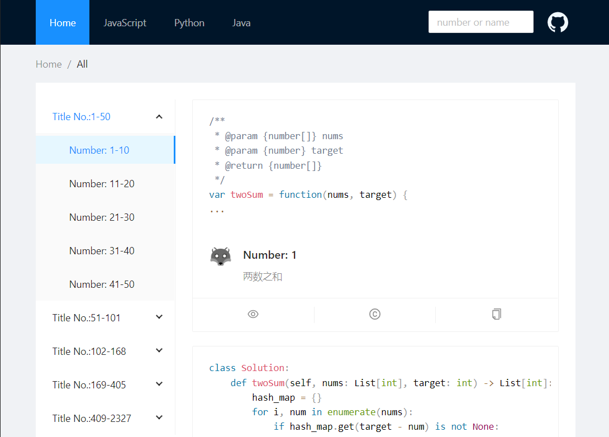
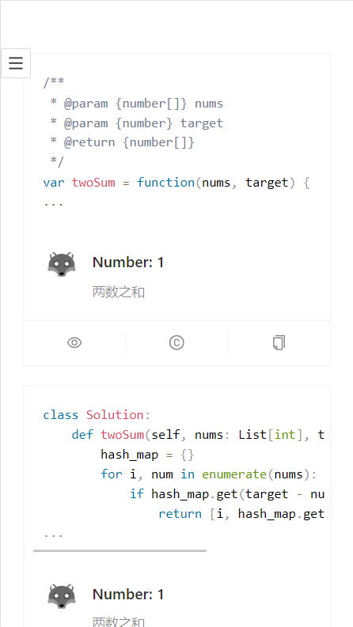
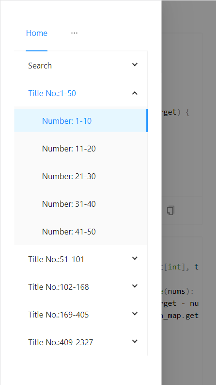
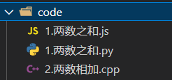
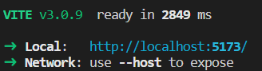

# 介绍

辛辛苦苦刷的`LeetCode`代码不展示出来，岂不对不起每天熬的夜和掉的头发。所以他来了，3分钟搭建属于自己的`LeetCode`展示平台。

# 效果

点击 [https://ncdhz.github.io/leetcode/](https://ncdhz.github.io/leetcode/)即可查看效果.

1. 电脑版本效果

`Python`和`JavaScript`等菜单表示使用什么语言完成的算法，其中`Home`表示所有语言。`Title No:1-50`表示编号为`1-50`的算法，`Number:1-10` 表示编号细分`1-10`的算法。搜索栏可以通过算法编号或者算法名字搜索对应的算法。




2. 手机版本效果

左图是手机端的页面，右图是手机端的菜单。




# 搭建

通过下面操作可以在自己的`Github`平台搭建出和上面一样的`LeetCode`展示平台。

1. 在`Visual Studio Code`中安装插件用来编写`LeetCode`算法，可以参考文章[VSCode 中安装LeetCode插件](https://zhuanlan.zhihu.com/p/561622236)。
2. 在自己的`Github`中`Fork` 项目[https://github.com/ncdhz/leetcode](https://github.com/ncdhz/leetcode)，或者下载此项目到本地配置完成后上传到自己的`Github`。

```shell
# 克隆项目到本地
>> git clone https://github.com/ncdhz/leetcode.git
```

3. 根据需要删除不需要的文件或文件夹。

```shell
# 此文件夹存放的是算法源文件，可以先不删除等搭建成功后换成自己的算法源文件就好。
>> rm -rf code
# 此文件夹是由vite打包生成的JavaScript、css、html和静态资源文件
>> rm -rf docs
# 此项目介绍文件
>> rm README.md
```

4. 配置`Node`环境，移步`Node`[官网](https://nodejs.org/en/)。
5. 安装项目依赖。

``` bash
# 有make环境
>> make install
# 没有make环境
>> cd web
>> npm install
```

6. 生成数据集，如下图算法文件名格式`number.name.[js/py...]`，`number`表示算法编号，`name`表示算法名称，最后是语言后缀。

> 不用担心新建文件麻烦，可以直接把`VSCode`中`LeetCode`插件的保存目录配置到`code`目录即可，[VSCode——设置代码存储目录](https://zhuanlan.zhihu.com/p/561622236)。



```bash
# 如果你保存算法目录是 code
# 有make环境
>> make code2db
# 没有make环境
>> node web/code2db.js code
# 如果你保存算法目录不是 code
>> node web/code2db.js 目录
```

7. 测试, 结果如下图，只需要在本地浏览器中访问 [http://localhost:5173/](http://localhost:5173/) 就可以浏览`LeetCode 展示平台了`。
   


``` bash
# 有make环境
>> make dev
# 没有make环境
>> cd web
>> npm run dev
```

8. 配置，配置文件在`web/src/config.ts`里，你可以更改里面的内容。

``` js
github: "https://github.com/ncdhz/leetcode/",
{
  // 你所使用的语言后缀，对应的语言名字。
  codeMessage: {
    // 语言后缀
    java: {
      // 语言名称
      name: "Java",
    },
    ...
  },
  // 每页显示数量
  itemSpace: 10,
  // 多少个小菜单组成一个大菜单
  menuSpace: 5,
  // logo 在public文件夹里面，你可以替换成自己的
  authorImg: "./logo.png",
  // 算法开始标志
  startFlag: "code=start",
  // 算法结束标志
  endFlag: "code=end"
}
```

9. 打包并上传到 `Github`，打包前可以删除 `docs` 文件夹。
    
``` bash
# 有make环境
>> make build
# 没有make环境
>> cd web 
>> npm run build

# 上传到Github
# 通过命令行 [如果你是Fork并clone你Fork的项目可以进行如下操作]
>> git add .
>> git commit -m "init"
>> git push -u origin main
```

10. `Github Pages`，上传到`Github`之后，需要配置`Github Pages`就能通过域名访问了。第一步打开`Github`中当前项目点击`Setting`，第二步点击`Pages`，第三步更改为`docs`目录并保存。等待几分钟就可以访问你的`LeetCode`展示平台了。网址[https://用户名.github.io/项目名](https://ncdhz.github.io/leetcode/)。
    


# 总结

此项目为`LeetCode 展示平台`，如果你有更好的想法可以提提意见说不定我就按照你的想法修改了呢。

> 一个工作都没有找到的同志花时间开发这个玩意——爱好，开发不易，多多Star，多多Fork。